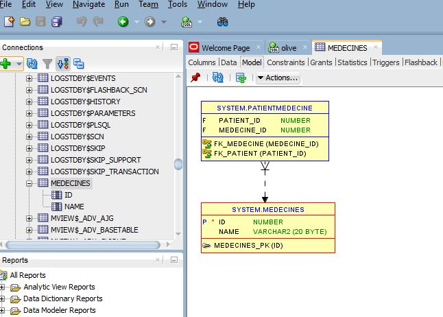
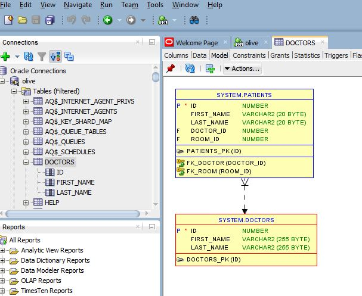
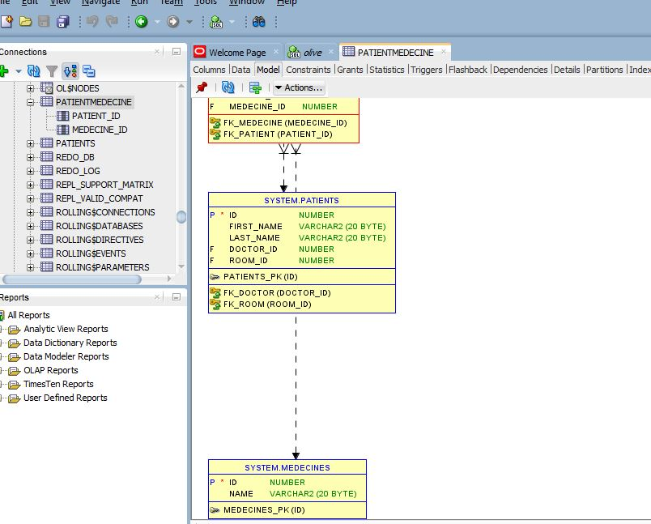
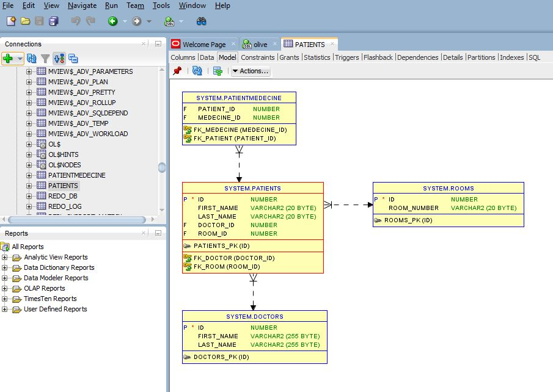
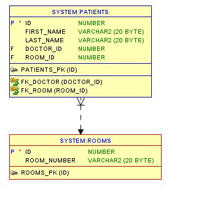
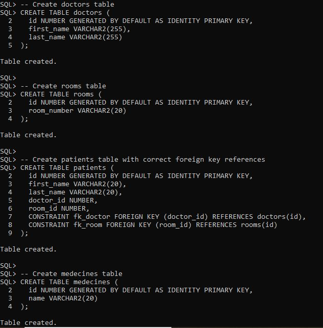
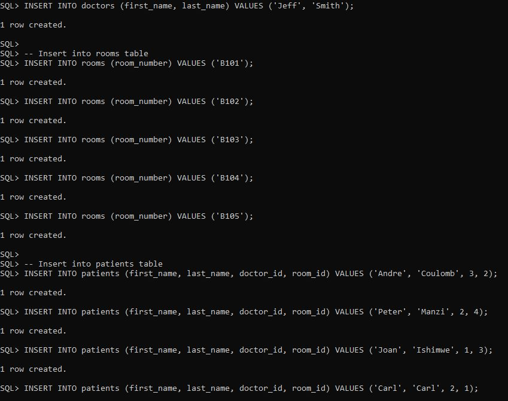
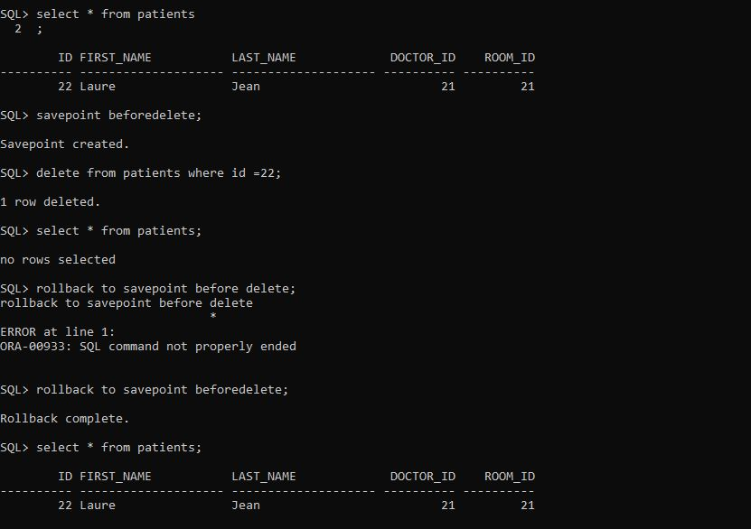
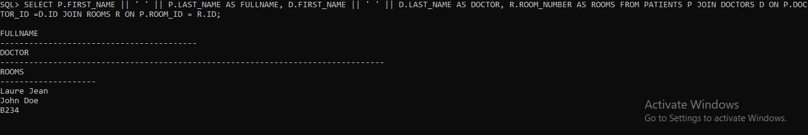
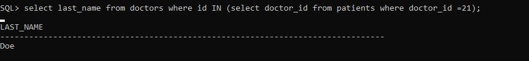

# Oracle SQL Test Scripts

## Problem Statement

This repository contains SQL commands to manage a system for handling Hospital management information. The system includes tableswith relationships between them. This database allows you to add, modify, and delete  information and their related .

## SQL Commands Executed

- DDL (Data Definition Language):**
  - Created tables `doctors` and `rooms`.
  - Defined primary and foreign keys.
- **DML (Data Manipulation Language):**
  - Inserted, updated, and deleted records in the tables.
- **Joins and Subqueries:**
  - Performed joins to retrieve customer orders.

## Conceptual Diagram

## SQL Queries

## Explanation

CREATE  query: This query create  all records from the All tables . The result displays the customer_id, first_name, and last_name of each customer

INSERT query: This command allows user to insert data in database

JOIN query: Operations are used to combine rows from two or more tables based on a related column between them. Joins allow you to retrieve data that is distributed across multiple tables, giving a more comprehensive view of related information.

 Subquerie query:They allow you to perform complex operations by executing a query within the context of another query. Subqueries can be used to filter results, aggregate data, perform calculations, and manipulate datasets in a more flexible and powerful way.

## Transaction Explanation

In SQL, a transaction is a sequence of database operations that are executed as a single unit of work. These transactions can be controlled using commands like COMMIT and ROLLBACK.
